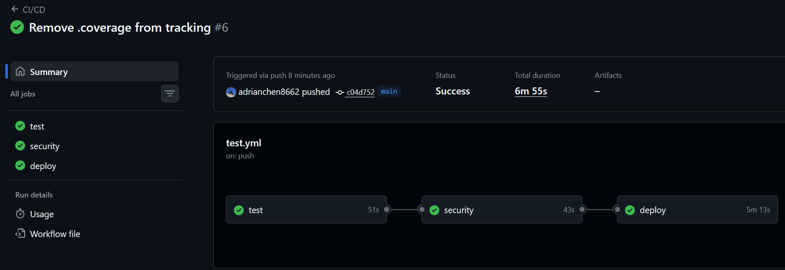
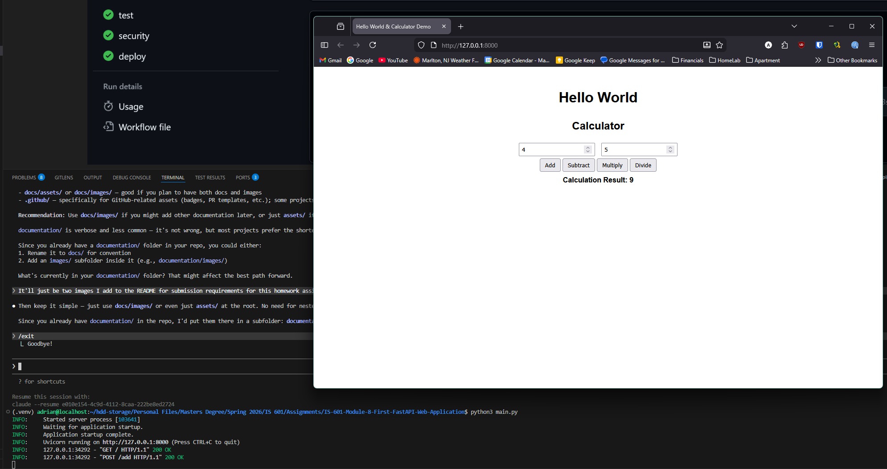

# IS-601 Module 8 — First FastAPI Web Application

A simple calculator web application built with FastAPI. 

## Features

- REST API endpoints for basic arithmetic: add, subtract, multiply, divide
- Jinja2 HTML frontend served at `/`
- Input validation via Pydantic
- Health check endpoint at `/health`
- Interactive API docs at `/docs`

## Endpoints

| Method | Path        | Description          |
|--------|-------------|----------------------|
| GET    | `/`         | Web UI               |
| GET    | `/health`   | Health check         |
| POST   | `/add`      | Add two numbers      |
| POST   | `/subtract` | Subtract two numbers |
| POST   | `/multiply` | Multiply two numbers |
| POST   | `/divide`   | Divide two numbers   |

All `POST` endpoints accept JSON: `{ "a": <number>, "b": <number> }`

## Running Locally

**With Docker:**
```bash
docker-compose up --build
```

**Without Docker:**
```bash
pip install -r requirements.txt
uvicorn main:app --reload
```

Then open `http://localhost:8000`.

## Testing

```bash
pytest --cov
```

Tests use `pytest`, `httpx`, and `playwright` for API and end-to-end coverage.

## Successful Github Actions Run Screenshot



## Running In Browser Screenshot



